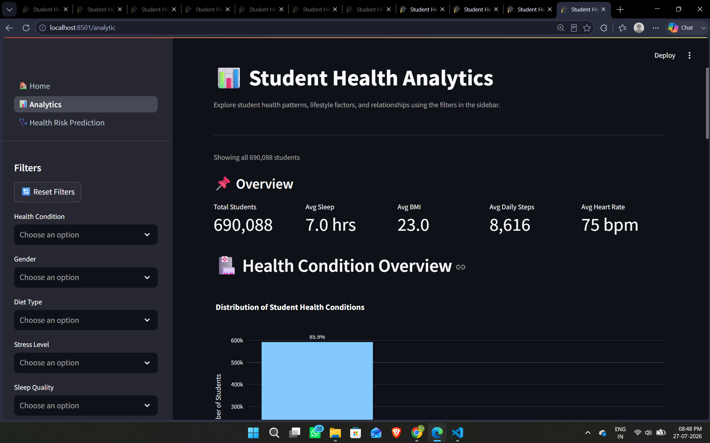
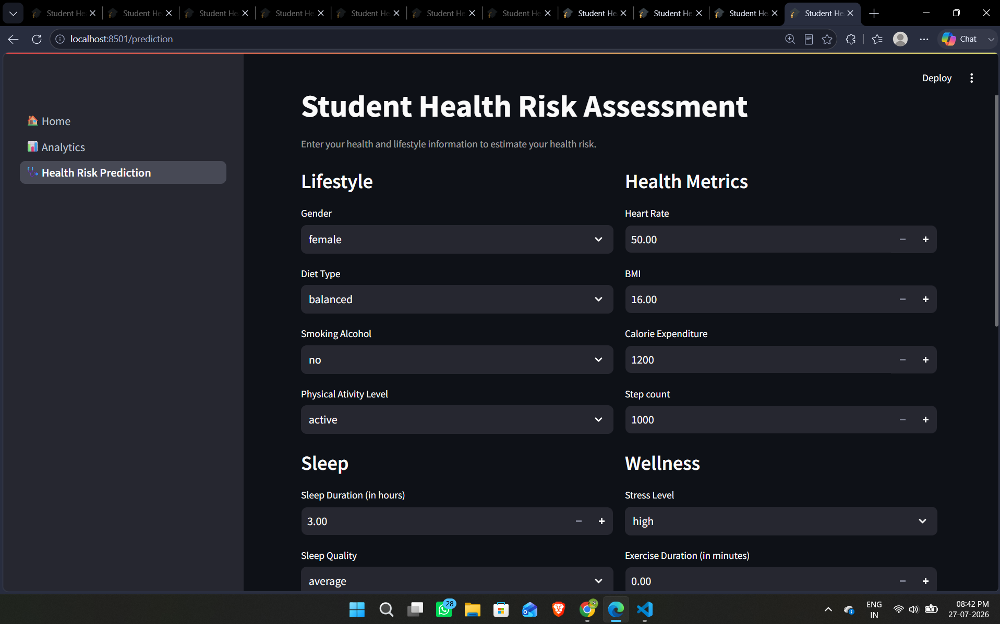
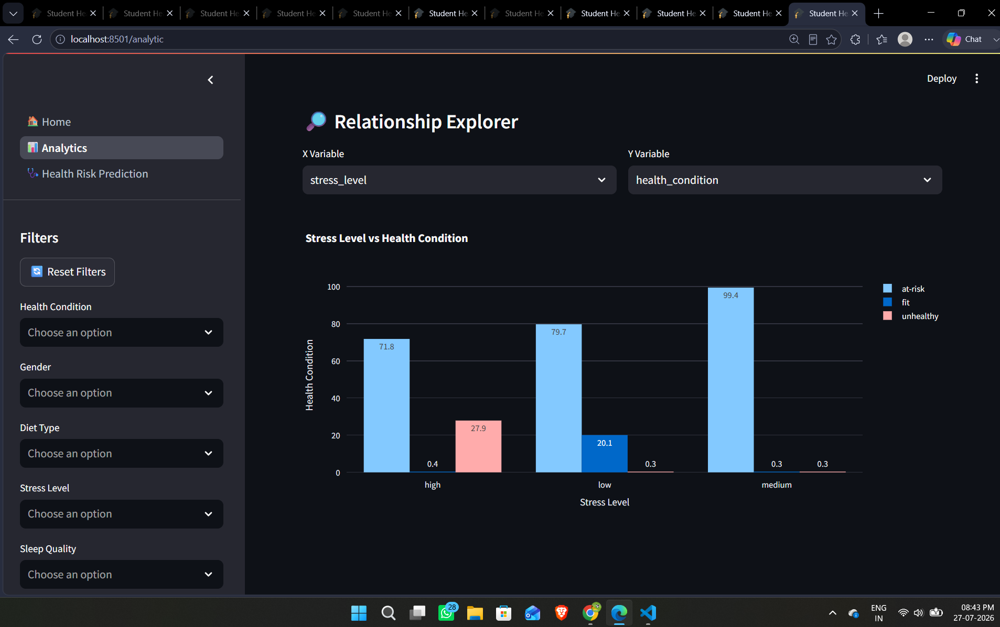

# 🎓 Student Health Risk Prediction System

An end-to-end machine learning application for analyzing student lifestyle and health patterns and predicting a student's health risk category.

The project covers the complete ML workflow — from data preprocessing and feature engineering to model comparison, cross-validation, error analysis, final model training, and deployment through an interactive Streamlit application.

---

## 📌 Project Overview

Student health can be influenced by several interconnected lifestyle factors such as sleep, physical activity, stress, diet, BMI, exercise, and daily habits.

This project builds a machine learning system that uses these factors to classify students into three health-risk categories:

- 🟢 **Fit**
- 🟡 **At-Risk**
- 🔴 **Unhealthy**

The project is not limited to prediction. It also provides an interactive analytics dashboard where users can explore relationships between lifestyle factors and health conditions.

---

## ✨ Key Features

### 🩺 Health Risk Prediction

Users can enter their health and lifestyle information and receive a predicted health condition.

The prediction module uses a trained **CatBoost multiclass classification model** and performs the same preprocessing and feature engineering used during model development.

Input features include factors such as:

- Gender
- Diet type
- Stress level
- Sleep quality
- Sleep duration
- Physical activity
- Smoking/alcohol habits
- BMI
- Heart rate
- Daily step count
- Exercise duration
- Water intake
- Calorie expenditure

---

### 📊 Interactive Analytics Dashboard

The analytics module allows users to explore the student health dataset interactively.

The dashboard includes:

- Overall health KPIs
- Health condition distribution
- Lifestyle vs health analysis
- Numerical health analysis
- Dynamic dataset filtering
- Relationship explorer
- Interactive Plotly visualizations

Users can filter the dataset by categorical and numerical variables and see the dashboard update dynamically.

---

## 📊 Analytics Module

### Overview KPIs

The dashboard provides high-level statistics such as:

- Total students
- Average sleep duration
- Average BMI
- Average daily steps
- Average heart rate

### Health Condition Overview

Visualizes the overall distribution of:

- Fit students
- At-risk students
- Unhealthy students

### Lifestyle & Health Analysis

The dashboard explores relationships between health condition and:

- Stress level
- Sleep quality
- Physical activity level
- Diet type
- Gender
- Smoking/alcohol habits

### Numerical Health Analysis

Users can interactively analyze numerical health variables across health-condition groups using distribution-based visualizations.

Examples include:

- Sleep duration
- BMI
- Step count
- Exercise duration
- Heart rate
- Water intake
- Calorie expenditure

### 🔎 Relationship Explorer

Users can choose two variables and dynamically investigate their relationship.

The visualization automatically adapts depending on the selected variable types, allowing exploration of:

- Numerical vs Numerical
- Numerical vs Categorical
- Categorical vs Categorical

---

## 🧠 Machine Learning Workflow

The project follows a structured machine learning development process:

```text
Raw Data
   │
   ▼
Data Cleaning
   │
   ▼
Missing Value Handling
   │
   ▼
Feature Engineering
   │
   ▼
Cross-Validation
   │
   ├── CatBoost
   ├── XGBoost
   └── LightGBM
   │
   ▼
Hyperparameter Optimization
   │
   ▼
Model Evaluation
   │
   ▼
Error Analysis
   │
   ▼
Model Blending Experiments
   │
   ▼
Final Model Selection
   │
   ▼
Train Final CatBoost Model
   │
   ▼
Streamlit Application
```

---

## ⚙️ Feature Engineering

The project includes custom feature engineering designed around interactions between lifestyle and health variables.

The preprocessing workflow handles:

- Numerical missing values
- Categorical missing values
- Sleep-duration missingness
- Categorical feature preparation
- Derived numerical features
- Interaction features
- Target-dependent encoding where appropriate during model experimentation

Care was taken during cross-validation to prevent information from validation folds leaking into training-time feature generation.

---

## 🤖 Model Development

Three gradient-boosting algorithms were extensively evaluated:

| Model | Purpose |
|---|---|
| **CatBoost** | Native categorical handling and final selected model |
| **XGBoost** | Strong gradient-boosting baseline |
| **LightGBM** | Efficient tree-based boosting model |

The models were evaluated using stratified cross-validation rather than relying on a single train-validation split.

---

## 🎯 Evaluation Metric

### Balanced Accuracy

The primary model-selection metric is **Balanced Accuracy**.

This was chosen because the target classes are imbalanced.

Ordinary accuracy can be dominated by the majority class, whereas balanced accuracy gives equal importance to recall across all classes.

The evaluation process also included:

- Precision
- Recall
- F1-score
- Classification report
- Confusion matrix
- Per-class error analysis
- Important confusion pairs
- Out-of-fold predictions

---

## 🔬 Error Analysis

Model evaluation goes beyond a single performance score.

The project analyzes:

- Total misclassifications
- Errors by true class
- Most common confusion pairs
- Errors across important lifestyle variables
- Class-specific recall
- Confusion matrices
- Out-of-fold prediction behaviour

This helps identify **where** the model fails instead of evaluating it only through aggregate metrics.

---

## 🔀 Ensemble Experiments

After training CatBoost, XGBoost, and LightGBM, probability-based blending was also tested.

The ensemble did not provide a meaningful improvement over the strongest standalone model.

Therefore, the additional inference complexity of deploying multiple models was avoided.

**CatBoost was selected as the final production model.**

This keeps inference simpler while retaining the strongest cross-validation performance observed during experimentation.

---

## 🏆 Final Model

The final application uses:

> **CatBoost Multiclass Classifier**

The final model is trained on the complete available training dataset after model selection and hyperparameter optimization.

Cross-validation models are used for reliable model evaluation, while a single final CatBoost model is used for application inference.

This separates:

- **Model evaluation** → cross-validation
- **Model deployment** → final model trained on the complete dataset

---

## 🖥️ Streamlit Application

The application contains three main sections.

### 🏠 Home

Introduces the project and explains its purpose and capabilities.

### 📊 Analytics

Interactive dashboard for exploring student health and lifestyle patterns.

### 🩺 Health Risk Prediction

Accepts health and lifestyle information and predicts the corresponding health-risk category.

---

## 🛠️ Tech Stack

### Programming & Data Processing

- Python
- NumPy
- Pandas

### Machine Learning

- Scikit-learn
- CatBoost
- XGBoost
- LightGBM

### Visualization

- Plotly
- Matplotlib
- Seaborn

### Application

- Streamlit

### Model Persistence

- Joblib / Pickle

---

## 📁 Project Structure

```text
student_health_risk_prediction_system/
│
├── app.py
│
├── pages/
│   ├── home.py
│   ├── analytic.py
│   └── prediction.py
│
├── notebooks/
|   ├── eda.ipynb
│   ├── model_development_catboost.ipynb
|   ├── model_development_lightgbm.ipynb
|   ├── model_development_xgboost.ipynb
|   ├── blending.ipynb
│   └── final_model.ipynb
│
├── utils/
│   ├── feature_engineering.py
│   ├── error_analysis.py
|   ├── evaluation.py
|   ├── final_probe.py
|   ├── predict_probe.py
|   ├── probes.py
|   ├── segmemted_weights.py
|   └── decision_optimization.py
│
├── models/
|   ├── final_catboost_1.pkl
|   ├── sleep_probe_1.pkl
|   ├── best_weights_catboost.npy
|   └── stress_probe_1.pkl
├
|── artifacts/
│   └── blending/
│       ├── oof_catboost.npy
│       ├── oof_xgboost.npy
│       ├── oof_lightgbm.npy
│       ├── test_catboost.npy
│       ├── test_xgboost.npy
│       └── test_lightgbm.npy
|
├── data/
│   ├── analytic_data.parquet
|   └── readme.md
│
├── assets/
│   ├── analytics-dashboard.png
│   ├── prediction-module.png
│   └── relationship-explorer.png
|
├── config/
|   └── input_options.json
|
├── requirements.txt
├── .gitignore
└── README.md
```

> Update this tree to match the final repository structure before publishing.

---

## 🚀 Running the Project Locally

### 1. Clone the repository

```bash
git clone https://github.com/harwinder766/student-health-risk-prediction-system.git
cd student-health-risk-prediction-system
```

### 2. Create a virtual environment

Using Conda:

```bash
conda create -n student-health python=3.10
conda activate student-health
```

or using `venv`:

```bash
python -m venv .venv
```

Activate it on Windows:

```bash
.venv\Scripts\activate
```

### 3. Install dependencies

```bash
pip install -r requirements.txt
```

### 4. Run the Streamlit application

```bash
streamlit run app.py
```
The application should then open in your browser.

---
## 🔁 Reproducing the Model Development

To reproduce the model-development experiments, follow these steps:

### 1. Download the Data from Kaggle

The dataset is available from the
**[Predicting Student Health Risk](https://www.kaggle.com/competitions/playground-series-s6e7)** Kaggle competition.

Download the competition files and place the required datasets inside the `data/` directory:

```text
data/
├── train.csv
└── test.csv
``` 

### 2. Run the Model Development Notebooks

```text
model_development_catboost.ipynb
model_development_xgboost.ipynb
model_development_lightgbm.ipynb
```

### 3. Reproduce the Blending Experiment

```text
notebooks/blending.ipynb
```

### 4. Train the Final Model

```text
notebooks/final_model.ipynb
```

## 📸 Application Screenshots

### 📊 Analytics Dashboard

Explore health-condition distributions, summary statistics, lifestyle factors,
and student health patterns using interactive filters.

<p align="center">
  
</p>

### 🩺 Health Risk Prediction

Enter student lifestyle, sleep, wellness, and health metrics to estimate
the student's health-risk category using the trained CatBoost model.

<p align="center">
  
</p>

### 🔎 Relationship Explorer

Interactively select variables to investigate relationships between health
and lifestyle characteristics.

<p align="center">
  
</p>

---

## 📈 Model Development Highlights

Some important aspects of the project include:

- End-to-end multiclass classification workflow
- Large-scale tabular dataset processing
- Handling class imbalance
- Custom feature engineering
- Leakage-aware cross-validation
- CatBoost native categorical feature handling
- XGBoost and LightGBM experimentation
- Out-of-fold evaluation
- Detailed error analysis
- Ensemble/blending experiments
- Final model retraining
- Interactive Streamlit deployment
- Dynamic analytics dashboard

---

## ⚠️ Important Disclaimer

This application is an **educational machine learning project**.

Predictions produced by the model should **not** be interpreted as medical diagnoses or professional medical advice.

The model identifies patterns based on the dataset on which it was trained and may not generalize to real-world clinical settings.

For actual health concerns, users should consult qualified healthcare professionals.

---

## 🔮 Future Improvements

Possible extensions include:

- Model explainability using SHAP
- Individual prediction explanations
- Probability calibration
- Additional health and lifestyle variables
- Model monitoring
- REST API deployment
- Authentication and prediction history
- Automated retraining pipeline

---

## 👨‍💻 Author

**Harwinder Singh**

B.Tech Computer Science & Engineering  
Machine Learning | Data Science | AI

GitHub: `https://github.com/harwinder766`

---

## ⭐ Support

If you find this project useful or interesting, consider giving the repository a ⭐.

Feedback and suggestions are welcome.